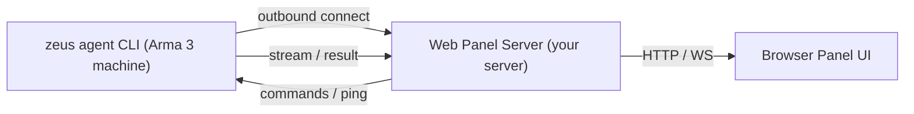
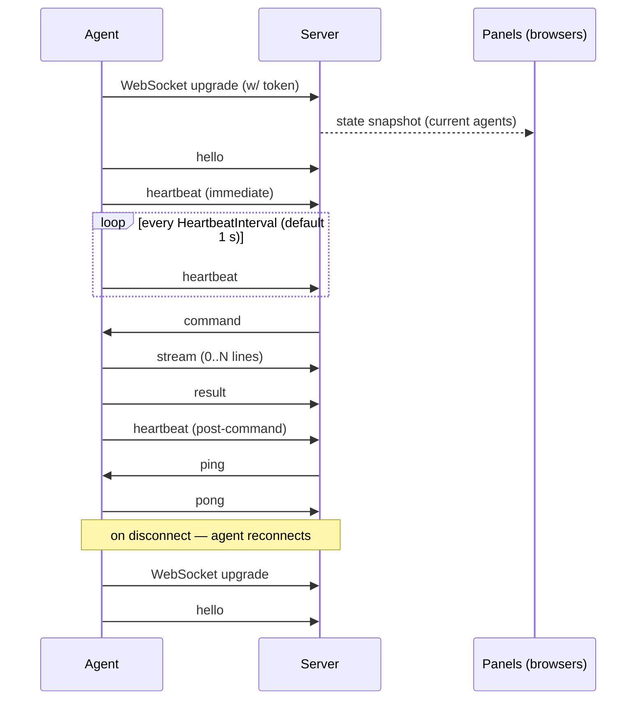
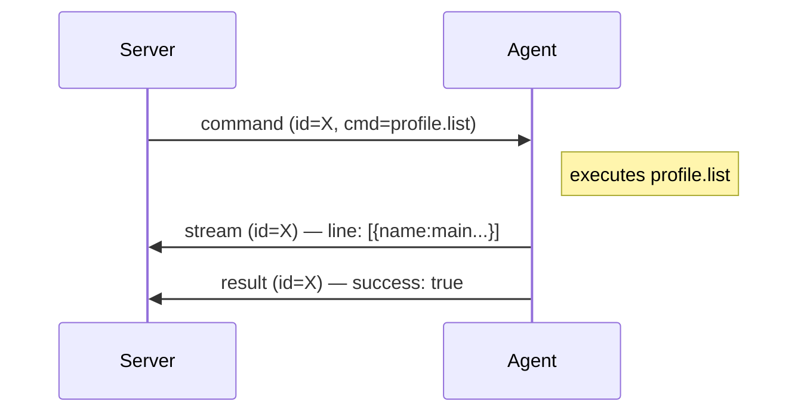
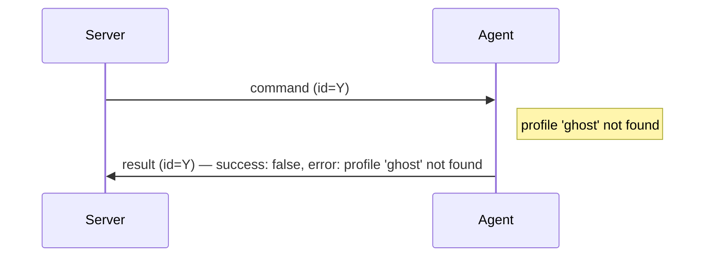
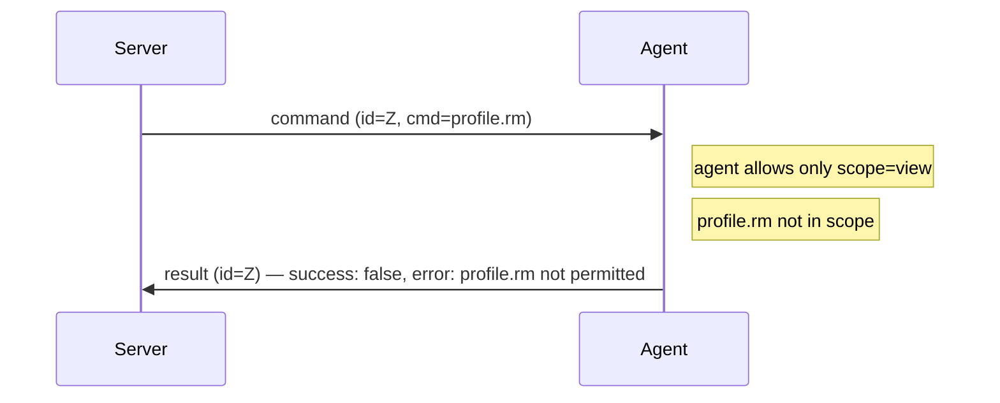
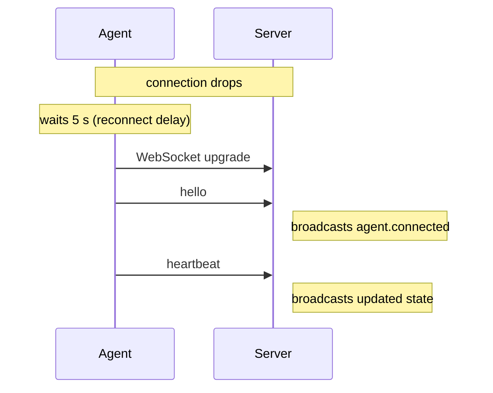
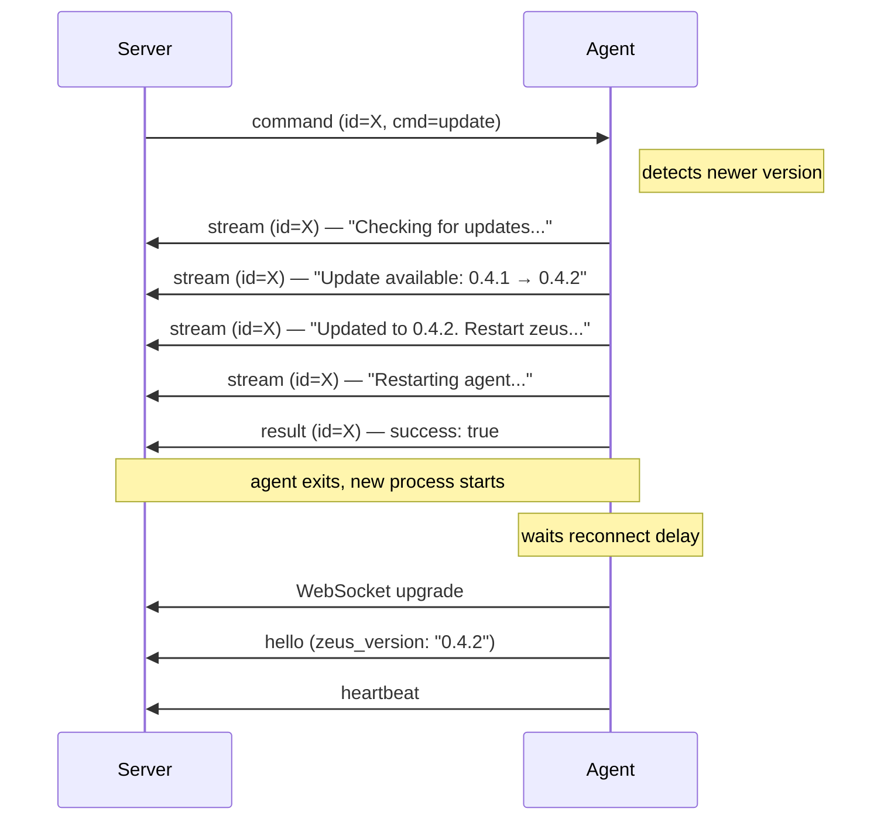
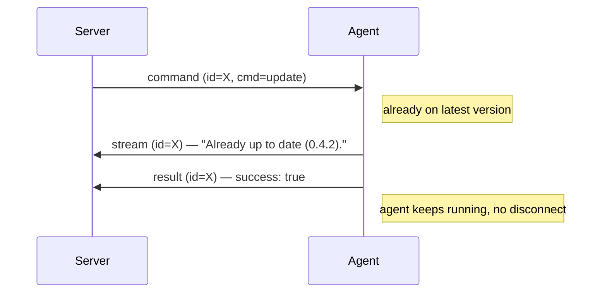

# Zeus Agent Protocol

A WebSocket-based protocol that allows a **zeus agent** (running on an Arma 3
server machine) to connect outbound to a **web panel server**, which can then
send commands and receive real-time output and status updates.

---

## Table of Contents

1. [Architecture](#architecture)
2. [Transport](#transport)
3. [Authentication](#authentication)
4. [Message Format (Envelope)](#message-format-envelope)
5. [Connection Lifecycle](#connection-lifecycle)
6. [Message Reference](#message-reference)
   - [hello](#hello)
   - [heartbeat](#heartbeat)
   - [command](#command)
   - [stream](#stream)
   - [result](#result)
   - [ping / pong](#ping--pong)
7. [Command Reference](#command-reference)
   - [profile.new](#profilenew)
   - [profile.list](#profilelist)
   - [profile.info](#profileinfo)
   - [profile.add](#profileadd)
   - [profile.start](#profilestart)
   - [profile.stop](#profilestop)
   - [profile.rm](#profilerm)
   - [missions.pull](#missionspull)
   - [update](#update)
8. [Scope System](#scope-system)
9. [State Snapshot on Connect](#state-snapshot-on-connect)
10. [Sequence Diagrams](#sequence-diagrams)
11. [Error Handling](#error-handling)
12. [Implementation Checklist](#implementation-checklist)
13. [Code Examples](#code-examples)

---

## Architecture



Key design decisions:

- **Agent connects outbound.** The agent initiates the TCP connection. This
  means the agent machine does not need any open inbound ports or port
  forwarding — it just needs outbound HTTPS/WSS access.
- **Single agent per machine.** One zeus agent process manages all profiles on
  that machine.
- **Concurrent commands.** Each command runs in its own goroutine. The
  correlation `id` field ties streams and results back to the originating
  command.
- **Stateless server.** The server holds no persistent state. All profile/process
  data lives on the agent machine and is reported via hello/heartbeat.

---

## Transport

| Parameter | Value |
|-----------|-------|
| Protocol  | WebSocket (RFC 6455) |
| Subprotocol | none |
| URL path for agents | `/ws/agent` |
| URL path for browsers | `/ws/panel` (implementation-specific) |
| Message encoding | JSON text frames |
| TLS | Recommended in production (`wss://`) |

The agent connects to:

```
wss://your-panel.example.com/ws/agent?name=<agent-name>
```

The `name` query parameter is the human-readable identifier shown in the panel.
It must be unique per panel instance. If two agents connect with the same name,
behavior is implementation-defined (typically the newer one replaces the older).

---

## Authentication

The agent sends a `Bearer` token in the HTTP `Authorization` header during the
WebSocket upgrade handshake:

```
GET /ws/agent?name=server-A HTTP/1.1
Upgrade: websocket
Authorization: Bearer <shared-secret-token>
```

The server **must** reject the upgrade with `401 Unauthorized` if the token is
missing or wrong. After upgrade, no further authentication is required.

The token is a shared secret configured identically on the server and in the
agent's `--token` flag.

---

## Message Format (Envelope)

Every message — in both directions — is a JSON object with this structure:

```json
{
  "id":      "<uuid or empty string>",
  "type":    "<message-type>",
  "payload": { ... }
}
```

| Field | Type | Description |
|-------|------|-------------|
| `id` | string | Correlation ID. Required for `command`, `stream`, `result`, and `ping`/`pong`. Omit (or `""`) for `hello`, `heartbeat`. |
| `type` | string | One of the message types listed below. |
| `payload` | object | Type-specific fields described in each section. |

**The `id` field ties a command to its stream lines and final result.** Generate
a UUID v4 per command on the server side, include it in the `command` message,
and expect all `stream` and `result` messages for that command to carry the same
`id`.

---

## Connection Lifecycle



The agent **always reconnects** after a disconnect. The reconnect delay is
configurable (default 5 s). The server should handle reconnects gracefully:
when an agent with the same name reconnects, update its state rather than
treating it as a new agent.

The heartbeat goroutine is scoped to each individual connection. When the
WebSocket read loop exits (server gone, network drop, or agent self-restart),
the heartbeat stops immediately and the reconnect loop fires without delay.

The agent also reconnects after a successful self-update — see [`update`](#update).

---

## Message Reference

### `hello`

**Direction:** agent → server  
**When:** immediately after the WebSocket connection is established.

```json
{
  "id": "",
  "type": "hello",
  "payload": {
    "agent": "server-A",
    "zeus_version": "0.2.0",
    "allowed_scopes": ["view", "control"]
  }
}
```

| Field | Type | Description |
|-------|------|-------------|
| `agent` | string | Agent name (same as the `?name=` URL parameter). |
| `zeus_version` | string | Zeus CLI version running on the agent machine. |
| `allowed_scopes` | string[] | Optional. Which command scopes this agent accepts. Absent or empty = all commands allowed. See [Scope System](#scope-system). |

---

### `heartbeat`

**Direction:** agent → server  
**When:** once immediately after `hello`, then periodically (default every 1 s). Also sent once after each command completes so the server receives updated profile/PID state without waiting for the next tick.

```json
{
  "id": "",
  "type": "heartbeat",
  "payload": {
    "agent": "server-A",
    "zeus_version": "0.2.0",
    "profiles": [
      { "name": "main",    "running": true,  "pid": 12345 },
      { "name": "dev",     "running": false }
    ],
    "allowed_scopes": ["view", "control"]
  }
}
```

| Field | Type | Description |
|-------|------|-------------|
| `agent` | string | Agent name. |
| `zeus_version` | string | Zeus CLI version. |
| `profiles` | ProfileStatus[] | Current state of every saved profile. |
| `allowed_scopes` | string[] | Same as in `hello`. |

**ProfileStatus object:**

| Field | Type | Description |
|-------|------|-------------|
| `name` | string | Profile name. |
| `running` | boolean | Whether the Arma 3 process is running. |
| `pid` | number | PID of the running process. Omitted when `running` is false. |

---

### `command`

**Direction:** server → agent  
**When:** when a panel user triggers a command.

```json
{
  "id": "550e8400-e29b-41d4-a716-446655440000",
  "type": "command",
  "payload": {
    "cmd": "profile.start",
    "args": {
      "name": "main",
      "dry_run": false
    }
  }
}
```

| Field | Type | Description |
|-------|------|-------------|
| `cmd` | string | Command name. See [Command Reference](#command-reference). |
| `args` | object | Command-specific arguments. See per-command arg table. |

The `id` must be a unique string (UUID v4 recommended) per command invocation.
The agent will echo it back in all `stream` and `result` messages.

---

### `stream`

**Direction:** agent → server  
**When:** zero or more times while a command is executing, once per output line.

```json
{
  "id": "550e8400-e29b-41d4-a716-446655440000",
  "type": "stream",
  "payload": {
    "line": "Profile 'main' started (PID 12345)",
    "fd": "stdout"
  }
}
```

| Field | Type | Description |
|-------|------|-------------|
| `line` | string | One line of output (newline already stripped). |
| `fd` | string | `"stdout"` or `"stderr"`. |

Lines arrive in order within a single command but may interleave across
concurrent commands (different `id` values).

---

### `result`

**Direction:** agent → server  
**When:** exactly once per command, after all `stream` messages.

```json
{
  "id": "550e8400-e29b-41d4-a716-446655440000",
  "type": "result",
  "payload": {
    "success": false,
    "exit_code": 1,
    "error": "profile \"ghost\" not found"
  }
}
```

| Field | Type | Description |
|-------|------|-------------|
| `success` | boolean | `true` if the command completed without error. |
| `exit_code` | number | Process exit code. `0` on success. |
| `error` | string | Human-readable error message. Empty on success. |

**Important:** a `result` with `success: false` and a scope-related error means
the command was rejected by the agent before execution:

```json
{
  "error": "command \"profile.rm\" is not permitted by this agent's scope configuration"
}
```

---

### `ping` / `pong`

**Direction:** server → agent (ping), agent → server (pong)  
**When:** optionally, to keep the connection alive or measure latency.

```json
{ "id": "ping-1", "type": "ping", "payload": {} }
{ "id": "ping-1", "type": "pong", "payload": {} }
```

The agent reflects the same `id` in the pong. Implementing ping/pong is
optional — the agent handles it, but the server is not required to send pings.
Standard WebSocket-level keepalives are sufficient.

---

## Command Reference

All commands use the `command` message type. The `cmd` field identifies the
operation; `args` carries parameters.

### `profile.new`

Generate a default profile template with Arma 3 defaults pre-populated. Useful for a panel editor that presents an empty-but-valid starting point before calling `profile.add`.

| Arg | Type | Required | Description |
|-----|------|----------|-------------|
| `name` | string | yes | Profile name for the template. |
| `format` | string | no | Output format: `json` (default), `yaml`, `toml`. |

**Stream output:** a complete profile template in the requested format, ready to be displayed in an editor or passed back as `content` to `profile.add`.

---

### `profile.list`

List all saved profiles with their running state. **Always returns compact JSON (one line).**

**Args:** none

**Stream output:**
```json
[{"name":"main","running":true,"pid":12345},{"name":"dev","running":false}]
```

---

### `profile.info`

Show detailed information about one profile.

| Arg | Type | Required | Description |
|-----|------|----------|-------------|
| `name` | string | yes | Profile name. |
| `format` | string | no | Output format: `json` (default), `yaml`, `toml`, `console`. |

**Stream output:** profile serialized in the requested format.

---

### `profile.add`

Register a profile from raw content (useful when the panel has an editor).

| Arg | Type | Required | Description |
|-----|------|----------|-------------|
| `name` | string | no | Override the profile name embedded in content. |
| `format` | string | no | Content format: `yaml` (default), `toml`, `json`. |
| `content` | string | yes | Full profile content as a string. |

**Notes:**
- If the profile already exists it is overwritten (force mode).
- The profile's config files (`.cfg`) are written immediately on add.
- A JSON Schema (draft-07) describing the full profile data model is available at
  `docs/schema/profile.json`. Panel editors can use it for validation and
  autocompletion when building a `profile.add` form.

---

### `profile.start`

Start the Arma 3 server for a profile.

| Arg | Type | Required | Description |
|-----|------|----------|-------------|
| `name` | string | yes | Profile name. |
| `dry_run` | boolean | no | If `true`, print the launch command without executing. |

**This command blocks until startup is confirmed or fails.** The agent:

1. Launches the server process and records the OS PID returned by the OS (`directPID`).
2. Polls for the server's own PID file (written by Arma 3 via `-pid=`). If `directPID` exits before the file appears, the command fails immediately.
3. Once the PID file appears, waits a 3 s stability window to confirm the process hasn't crashed on startup.
4. Returns an error if the PID file does not appear within 60 s or the process exits during the stability window.

**Stream output (on success):**
```
Starting profile "main"...
Running pre-start hooks...      ← only if pre_profile_start or pre_profile_run hooks are configured
Launching server process...
Process started (launcher PID 9801), waiting for initialization (timeout 1m0s)...
Profile "main" started (PID 12345).
Running post-start hooks...     ← only if post_profile_run or post_profile_start hooks are configured
```

`profile.start` can take up to 60 s. The panel should display streamed progress lines as they arrive rather than waiting for the final `result`.

---

### `profile.stop`

Stop the running Arma 3 server for a profile.

| Arg | Type | Required | Description |
|-----|------|----------|-------------|
| `name` | string | yes | Profile name. |

**Stream output:**
```
Running pre-stop hooks...       ← only if pre_profile_stop hooks are configured
Waiting for process 12345 to terminate...
Profile "main" stopped.
Running post-stop hooks...      ← only if post_profile_stop hooks are configured
```

---

### `profile.rm`

Delete a profile and all its data. **Runs in force mode — no confirmation prompt.**

| Arg | Type | Required | Description |
|-----|------|----------|-------------|
| `name` | string | yes | Profile name. |

---

### `missions.pull`

Sync mission files from the configured source (path copy or S3).

| Arg | Type | Required | Description |
|-----|------|----------|-------------|
| `name` | string | yes | Profile name. |
| `dry_run` | boolean | no | If `true`, report changes without copying files. |

**Stream output:**
```
Running pre-pull hooks...                        ← only if pre_pull_missions hooks are configured
Pulling missions for "main" (path, copy)
  + new_mission.Altis.pbo                        ← added
  ~ updated_mission.Stratis.pbo                  ← updated
  - old_mission.VR.pbo                           ← removed
  = unchanged_mission.Malden.pbo                 ← skipped (identical)
  ! locked_mission.Tanoa.pbo                     ← server running, can't replace
Done. 1 added, 1 updated, 1 removed, 1 unchanged.
Running post-pull hooks...                       ← only if post_pull_missions hooks are configured
```

Prefix `[dry-run]` is prepended to the header line when `dry_run` is `true`. Files that cannot be updated because the server is running are marked `!`; stop the server and re-run to apply them.

---

### `update`

Self-update the zeus binary to the latest release.

**Args:** none

**Behavior in agent mode:**

| Condition | Stream output | Result | After result |
|-----------|---------------|--------|--------------|
| Update available | version lines + `"Restarting agent..."` | `success: true` | Agent restarts with new binary |
| Already up to date | `"Already up to date (X)."` | `success: true` | Nothing — agent keeps running |
| Error (network, GitHub) | error description | `success: false` | Nothing — agent keeps running |

When an update is applied the agent: sends all stream lines, sends `result` with `success: true`, then spawns a new process from the updated binary using the original startup arguments and exits. The panel should expect a brief disconnect followed by a reconnect carrying the new `zeus_version` in the next `hello`.

**No restart occurs if the agent is already on the latest version.**

---

## Scope System

The agent operator can restrict which commands the agent accepts using the
`--allow` flag. This limits the blast radius of a compromised or misconfigured
panel.

### Scope Names

| Scope | Included Commands |
|-------|-------------------|
| `view` | `profile.list`, `profile.info` |
| `control` | `profile.start`, `profile.stop` |
| `manage` | `profile.new`, `profile.add`, `profile.rm`, `missions.pull` |
| `update` | `update` |
| `all` | All commands (default when `--allow` is omitted) |

### Combining Scopes

Scopes are additive. Pass a comma-separated list:

```bash
# Read-only panel — can only list and inspect profiles
zeus agent --url wss://panel.example.com/ws/agent --token abc123 --allow view

# Operations panel — can start/stop and view, but cannot create/delete profiles
zeus agent --url wss://panel.example.com/ws/agent --token abc123 --allow view,control

# Full access (same as default)
zeus agent --url wss://panel.example.com/ws/agent --token abc123 --allow all
```

### How the Server Should Use `allowed_scopes`

The agent reports its allowed scopes in both `hello` and `heartbeat` payloads.
Your server should:

1. **Store** `allowed_scopes` per connected agent.
2. **Expose** it to the browser so the UI can hide or disable unavailable commands.
3. **Not enforce** scopes server-side — scope enforcement is the agent's
   responsibility. The agent will return a `result` with `success: false` and a
   descriptive error if a disallowed command is sent.

If `allowed_scopes` is absent or an empty array, all commands are permitted.

---

## State Snapshot on Connect

When a **browser** (panel UI) connects to the server's `/ws/panel` endpoint,
the server should immediately send a full state snapshot so the UI can populate
without waiting for the agent's next periodic heartbeat:

```json
{
  "id": "",
  "type": "state",
  "payload": {
    "agents": [
      {
        "name": "server-A",
        "version": "0.2.0",
        "profiles": [
          { "name": "main", "running": true, "pid": 12345 }
        ],
        "connectedAt": 1716000000000,
        "allowed_scopes": ["view", "control"]
      }
    ]
  }
}
```

This `state` message is a server → browser concern and is not part of the
agent protocol itself. Its format is implementation-specific.

---

## Sequence Diagrams

### Successful Command



### Failed Command (Profile Not Found)



### Disallowed Command (Scope Violation)



### Reconnect



### Update with Auto-Restart



### Update — Already Up to Date (No Restart)



---

## Error Handling

| Scenario | Agent behavior |
|----------|---------------|
| Malformed `command` JSON | Returns `result` with `success: false`, `error: "malformed command payload"` |
| Unknown command name | Returns `result` with `success: false`, `error: "unknown command: <name>"` |
| Command outside allowed scope | Returns `result` with `success: false`, `error: "command \"<name>\" is not permitted..."` |
| Command execution error | Returns `result` with `success: false`, `error: <error message>` |
| WebSocket write failure | Agent closes the connection and reconnects |
| Server disconnect | Agent waits reconnect delay (default 5 s) then reconnects |
| `update` — new version applied | Returns `result` with `success: true`, then spawns updated binary and exits |
| `update` — already up to date | Returns `result` with `success: true`, agent keeps running |

---

## Implementation Checklist

### Minimum viable server

- [ ] Accept WebSocket upgrades at `/ws/agent?name=<name>`
- [ ] Validate `Authorization: Bearer <token>` header; reject with 401 on mismatch
- [ ] Parse incoming agent messages: `hello`, `heartbeat`, `stream`, `result`
- [ ] Store agent state: name, version, profiles, allowed_scopes, connectedAt
- [ ] Broadcast `agent.connected` / `agent.disconnected` to connected browsers
- [ ] Route `stream` and `result` back to the browser that sent the originating `command`
- [ ] Send a `state` snapshot to newly connected browsers
- [ ] Accept `command` from browsers; forward to the correct agent WebSocket
- [ ] Validate that the target agent is still connected before forwarding
- [ ] Clean up `sources` map entry after receiving `result`

### Production hardening

- [ ] Use `wss://` (TLS) in production
- [ ] Rate-limit command sends per agent
- [ ] Validate command `id` format before forwarding
- [ ] Handle duplicate agent names (reject or replace)
- [ ] Persist agent state across server restarts (optional — agents re-send on reconnect)
- [ ] Log all command sends, results, and agent connect/disconnect events

---

## Code Examples

The examples below implement a minimal broker that:
- Accepts agent connections at `/ws/agent`
- Accepts browser connections at `/ws/panel`
- Forwards commands from browsers to agents
- Routes responses back to the originating browser

### Node.js (ws library)

```javascript
import { WebSocketServer, WebSocket } from 'ws'
import { createServer } from 'http'
import { randomUUID } from 'crypto'

const TOKEN   = process.env.ZEUS_TOKEN ?? 'change-me'
const PORT    = Number(process.env.PORT ?? 3001)

const agents  = new Map()   // name → { ws, version, profiles, allowedScopes, connectedAt }
const panels  = new Set()   // browser WebSocket connections
const sources = new Map()   // commandId → panel WebSocket

function send(ws, msg) {
  if (ws.readyState === WebSocket.OPEN) ws.send(JSON.stringify(msg))
}

function broadcast(msg) {
  for (const ws of panels) send(ws, msg)
}

// ── HTTP server ───────────────────────────────────────────────────────────────

const server = createServer((req, res) => {
  res.writeHead(200).end('zeus panel broker')
})

const wss = new WebSocketServer({ noServer: true })

server.on('upgrade', (req, socket, head) => {
  const url    = new URL(req.url, 'http://localhost')
  const path   = url.pathname

  if (path === '/ws/agent') {
    const auth = (req.headers['authorization'] ?? '').replace('Bearer ', '')
    if (auth !== TOKEN) {
      socket.write('HTTP/1.1 401 Unauthorized\r\n\r\n')
      socket.destroy()
      return
    }
    const name = url.searchParams.get('name') ?? randomUUID()
    wss.handleUpgrade(req, socket, head, ws => onAgent(ws, name))
    return
  }

  if (path === '/ws/panel') {
    wss.handleUpgrade(req, socket, head, ws => onPanel(ws))
  }
})

// ── Agent handler ─────────────────────────────────────────────────────────────

function onAgent(ws, name) {
  console.log(`[agent +] ${name}`)
  const state = { ws, name, version: '', profiles: [], allowedScopes: [], connectedAt: Date.now() }
  agents.set(name, state)
  broadcast({ type: 'agent.connected', agentName: name })

  ws.on('message', raw => {
    let env
    try { env = JSON.parse(raw.toString()) } catch { return }

    const p = env.payload ?? {}

    if (env.type === 'hello') {
      state.version       = p.zeus_version ?? ''
      state.allowedScopes = p.allowed_scopes ?? []
      broadcast({ type: 'hello', agentName: name, version: state.version, allowed_scopes: state.allowedScopes })
    }

    if (env.type === 'heartbeat') {
      state.version       = p.zeus_version ?? state.version
      state.profiles      = p.profiles ?? []
      state.allowedScopes = p.allowed_scopes ?? state.allowedScopes
      broadcast({ type: 'heartbeat', agentName: name, version: state.version,
                  profiles: state.profiles, allowed_scopes: state.allowedScopes })
    }

    if (env.type === 'stream') {
      const panel = sources.get(env.id)
      const msg   = { type: 'stream', agentName: name, id: env.id,
                      line: p.line ?? '', fd: p.fd ?? 'stdout' }
      if (panel) send(panel, msg); else broadcast(msg)
    }

    if (env.type === 'result') {
      const panel = sources.get(env.id)
      const msg   = { type: 'result', agentName: name, id: env.id,
                      success: p.success ?? false, exit_code: p.exit_code ?? 1,
                      error: p.error ?? '' }
      if (panel) send(panel, msg); else broadcast(msg)
      sources.delete(env.id)
    }
  })

  ws.on('close', () => {
    console.log(`[agent -] ${name}`)
    agents.delete(name)
    broadcast({ type: 'agent.disconnected', agentName: name })
  })
}

// ── Panel handler ─────────────────────────────────────────────────────────────

function onPanel(ws) {
  panels.add(ws)

  // Send current state snapshot
  send(ws, {
    type: 'state',
    agents: [...agents.values()].map(a => ({
      name: a.name, version: a.version, profiles: a.profiles,
      allowed_scopes: a.allowedScopes, connectedAt: a.connectedAt,
    })),
  })

  ws.on('message', raw => {
    let msg
    try { msg = JSON.parse(raw.toString()) } catch { return }
    if (msg.type !== 'command') return

    const { agentName, id, cmd, args } = msg
    const agent = agents.get(agentName)

    if (!agent || agent.ws.readyState !== WebSocket.OPEN) {
      send(ws, { type: 'result', agentName, id, success: false,
                 error: `agent "${agentName}" not connected` })
      return
    }

    sources.set(id, ws)
    agent.ws.send(JSON.stringify({ id, type: 'command', payload: { cmd, args: args ?? {} } }))
  })

  ws.on('close', () => panels.delete(ws))
}

server.listen(PORT, () => console.log(`zeus panel broker → http://localhost:${PORT}`))
```

---

### Python (websockets library)

```python
import asyncio, json, os
from uuid import uuid4
from websockets.server import serve, WebSocketServerProtocol

TOKEN = os.environ.get("ZEUS_TOKEN", "change-me")
PORT  = int(os.environ.get("PORT", 3001))

agents:  dict[str, dict] = {}   # name → state dict
panels:  set[WebSocketServerProtocol] = set()
sources: dict[str, WebSocketServerProtocol] = {}

async def send(ws, msg: dict):
    if ws.open:
        await ws.send(json.dumps(msg))

async def broadcast(msg: dict):
    for ws in list(panels):
        await send(ws, msg)

async def on_agent(ws: WebSocketServerProtocol, name: str):
    print(f"[agent +] {name}")
    state = {"ws": ws, "name": name, "version": "", "profiles": [],
             "allowed_scopes": [], "connectedAt": 0}
    agents[name] = state
    await broadcast({"type": "agent.connected", "agentName": name})

    try:
        async for raw in ws:
            try:
                env = json.loads(raw)
            except Exception:
                continue
            p = env.get("payload") or {}

            if env["type"] == "hello":
                state["version"]        = p.get("zeus_version", "")
                state["allowed_scopes"] = p.get("allowed_scopes") or []
                await broadcast({"type": "hello", "agentName": name,
                                 "version": state["version"],
                                 "allowed_scopes": state["allowed_scopes"]})

            elif env["type"] == "heartbeat":
                state["version"]        = p.get("zeus_version", state["version"])
                state["profiles"]       = p.get("profiles") or []
                state["allowed_scopes"] = p.get("allowed_scopes") or state["allowed_scopes"]
                await broadcast({"type": "heartbeat", "agentName": name,
                                 "version": state["version"], "profiles": state["profiles"],
                                 "allowed_scopes": state["allowed_scopes"]})

            elif env["type"] == "stream":
                msg = {"type": "stream", "agentName": name, "id": env.get("id"),
                       "line": p.get("line", ""), "fd": p.get("fd", "stdout")}
                panel = sources.get(env.get("id"))
                if panel: await send(panel, msg)
                else: await broadcast(msg)

            elif env["type"] == "result":
                eid = env.get("id")
                msg = {"type": "result", "agentName": name, "id": eid,
                       "success": p.get("success", False),
                       "exit_code": p.get("exit_code", 1),
                       "error": p.get("error", "")}
                panel = sources.pop(eid, None)
                if panel: await send(panel, msg)
                else: await broadcast(msg)

    finally:
        print(f"[agent -] {name}")
        agents.pop(name, None)
        await broadcast({"type": "agent.disconnected", "agentName": name})

async def on_panel(ws: WebSocketServerProtocol):
    panels.add(ws)
    await send(ws, {
        "type": "state",
        "agents": [{"name": s["name"], "version": s["version"],
                    "profiles": s["profiles"], "allowed_scopes": s["allowed_scopes"],
                    "connectedAt": s["connectedAt"]}
                   for s in agents.values()],
    })
    try:
        async for raw in ws:
            try:
                msg = json.loads(raw)
            except Exception:
                continue
            if msg.get("type") != "command":
                continue

            agent_name = msg.get("agentName")
            cmd_id     = msg.get("id")
            state      = agents.get(agent_name)

            if not state or not state["ws"].open:
                await send(ws, {"type": "result", "agentName": agent_name,
                                "id": cmd_id, "success": False,
                                "error": f'agent "{agent_name}" not connected'})
                continue

            sources[cmd_id] = ws
            await state["ws"].send(json.dumps({
                "id": cmd_id, "type": "command",
                "payload": {"cmd": msg.get("cmd"), "args": msg.get("args") or {}},
            }))
    finally:
        panels.discard(ws)

async def handler(ws: WebSocketServerProtocol):
    path = ws.request.path
    if path.startswith("/ws/agent"):
        auth = ws.request.headers.get("Authorization", "").removeprefix("Bearer ")
        if auth != TOKEN:
            await ws.close(1008, "Unauthorized")
            return
        from urllib.parse import urlparse, parse_qs
        name = parse_qs(urlparse(path).query).get("name", [str(uuid4())])[0]
        await on_agent(ws, name)
    elif path == "/ws/panel":
        await on_panel(ws)

async def main():
    async with serve(handler, "0.0.0.0", PORT):
        print(f"zeus panel broker → ws://localhost:{PORT}")
        await asyncio.Future()  # run forever

asyncio.run(main())
```

---

### Go

```go
package main

import (
    "encoding/json"
    "fmt"
    "log"
    "net/http"
    "sync"

    "github.com/google/uuid"
    "github.com/gorilla/websocket"
)

var (
    token    = envOr("ZEUS_TOKEN", "change-me")
    upgrader = websocket.Upgrader{CheckOrigin: func(r *http.Request) bool { return true }}
)

type agentState struct {
    ws            *websocket.Conn
    mu            sync.Mutex
    name          string
    version       string
    profiles      []map[string]any
    allowedScopes []string
    connectedAt   int64
}

func (a *agentState) send(msg any) {
    data, _ := json.Marshal(msg)
    a.mu.Lock()
    defer a.mu.Unlock()
    a.ws.WriteMessage(websocket.TextMessage, data)
}

var (
    agentsMu sync.RWMutex
    agents   = map[string]*agentState{}

    panelsMu sync.RWMutex
    panels   = map[*websocket.Conn]struct{}{}

    sourcesMu sync.Mutex
    sources   = map[string]*websocket.Conn{}
)

func broadcast(msg any) {
    data, _ := json.Marshal(msg)
    panelsMu.RLock()
    defer panelsMu.RUnlock()
    for ws := range panels {
        ws.WriteMessage(websocket.TextMessage, data)
    }
}

func panelSend(ws *websocket.Conn, msg any) {
    data, _ := json.Marshal(msg)
    ws.WriteMessage(websocket.TextMessage, data)
}

func agentHandler(w http.ResponseWriter, r *http.Request) {
    auth := r.Header.Get("Authorization")
    if auth != "Bearer "+token {
        http.Error(w, "Unauthorized", http.StatusUnauthorized)
        return
    }
    name := r.URL.Query().Get("name")
    if name == "" {
        name = uuid.New().String()
    }

    conn, err := upgrader.Upgrade(w, r, nil)
    if err != nil {
        return
    }
    defer conn.Close()

    state := &agentState{ws: conn, name: name}
    agentsMu.Lock()
    agents[name] = state
    agentsMu.Unlock()
    broadcast(map[string]any{"type": "agent.connected", "agentName": name})
    log.Printf("[agent +] %s", name)

    defer func() {
        agentsMu.Lock()
        delete(agents, name)
        agentsMu.Unlock()
        broadcast(map[string]any{"type": "agent.disconnected", "agentName": name})
        log.Printf("[agent -] %s", name)
    }()

    for {
        _, raw, err := conn.ReadMessage()
        if err != nil {
            return
        }
        var env struct {
            ID      string          `json:"id"`
            Type    string          `json:"type"`
            Payload json.RawMessage `json:"payload"`
        }
        if err := json.Unmarshal(raw, &env); err != nil {
            continue
        }

        var p map[string]json.RawMessage
        json.Unmarshal(env.Payload, &p)

        switch env.Type {
        case "hello", "heartbeat":
            var version string
            json.Unmarshal(p["zeus_version"], &version)
            var profiles []map[string]any
            json.Unmarshal(p["profiles"], &profiles)
            var scopes []string
            json.Unmarshal(p["allowed_scopes"], &scopes)

            state.version = version
            if profiles != nil { state.profiles = profiles }
            if scopes != nil { state.allowedScopes = scopes }

            broadcast(map[string]any{
                "type": env.Type, "agentName": name,
                "version": state.version, "profiles": state.profiles,
                "allowed_scopes": state.allowedScopes,
            })

        case "stream":
            var line, fd string
            json.Unmarshal(p["line"], &line)
            json.Unmarshal(p["fd"], &fd)
            msg := map[string]any{"type": "stream", "agentName": name,
                                  "id": env.ID, "line": line, "fd": fd}
            sourcesMu.Lock()
            panel := sources[env.ID]
            sourcesMu.Unlock()
            if panel != nil { panelSend(panel, msg) } else { broadcast(msg) }

        case "result":
            var success bool
            var exitCode int
            var errMsg string
            json.Unmarshal(p["success"], &success)
            json.Unmarshal(p["exit_code"], &exitCode)
            json.Unmarshal(p["error"], &errMsg)

            msg := map[string]any{"type": "result", "agentName": name,
                                  "id": env.ID, "success": success,
                                  "exit_code": exitCode, "error": errMsg}
            sourcesMu.Lock()
            panel := sources[env.ID]
            delete(sources, env.ID)
            sourcesMu.Unlock()
            if panel != nil { panelSend(panel, msg) } else { broadcast(msg) }
        }
    }
}

func panelHandler(w http.ResponseWriter, r *http.Request) {
    conn, err := upgrader.Upgrade(w, r, nil)
    if err != nil {
        return
    }
    defer conn.Close()

    panelsMu.Lock()
    panels[conn] = struct{}{}
    panelsMu.Unlock()
    defer func() {
        panelsMu.Lock()
        delete(panels, conn)
        panelsMu.Unlock()
    }()

    // Send state snapshot
    agentsMu.RLock()
    list := make([]map[string]any, 0, len(agents))
    for _, a := range agents {
        list = append(list, map[string]any{
            "name": a.name, "version": a.version,
            "profiles": a.profiles, "allowed_scopes": a.allowedScopes,
        })
    }
    agentsMu.RUnlock()
    panelSend(conn, map[string]any{"type": "state", "agents": list})

    for {
        _, raw, err := conn.ReadMessage()
        if err != nil {
            return
        }
        var msg struct {
            Type      string         `json:"type"`
            AgentName string         `json:"agentName"`
            ID        string         `json:"id"`
            Cmd       string         `json:"cmd"`
            Args      map[string]any `json:"args"`
        }
        if err := json.Unmarshal(raw, &msg); err != nil || msg.Type != "command" {
            continue
        }

        agentsMu.RLock()
        a := agents[msg.AgentName]
        agentsMu.RUnlock()

        if a == nil {
            panelSend(conn, map[string]any{
                "type": "result", "agentName": msg.AgentName,
                "id": msg.ID, "success": false,
                "error": fmt.Sprintf("agent %q not connected", msg.AgentName),
            })
            continue
        }

        sourcesMu.Lock()
        sources[msg.ID] = conn
        sourcesMu.Unlock()

        a.send(map[string]any{
            "id": msg.ID, "type": "command",
            "payload": map[string]any{"cmd": msg.Cmd, "args": msg.Args},
        })
    }
}

func main() {
    http.HandleFunc("/ws/agent", agentHandler)
    http.HandleFunc("/ws/panel", panelHandler)
    log.Println("zeus panel broker → :3001")
    log.Fatal(http.ListenAndServe(":3001", nil))
}

func envOr(key, def string) string {
    if v := os.Getenv(key); v != "" { return v }
    return def
}
```

---

## Notes for AI Implementors

- The `payload` field in the Envelope is always a **JSON object** (never a
  primitive or array). Decode `env.payload` into a typed struct or a
  `map[string]any`.
- `allowed_scopes` being absent in JSON is identical to `[]` — both mean
  "allow all". Check with `len(scopes) == 0` rather than a nil check.
- Command IDs are generated by the **server** (or browser), not the agent.
  Use UUID v4.
- The `sources` map is **not** bounded. Clean up entries after receiving a
  `result`, and handle browser disconnects by scanning and removing stale entries.
- `stream` messages arrive while the command is still running. Do not wait
  for `result` before displaying them.
- Multiple concurrent commands from the same browser are allowed. Track by `id`.
